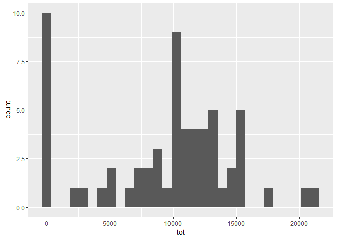
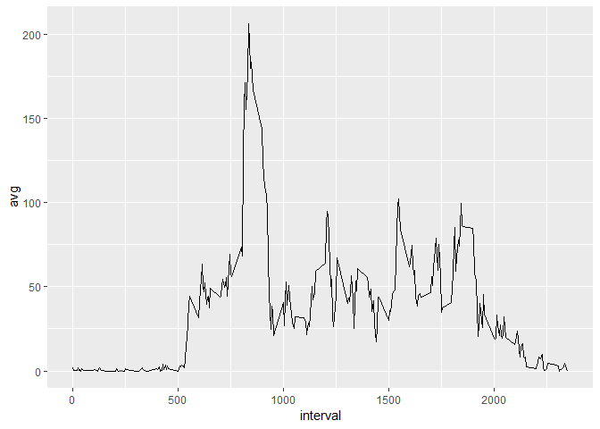
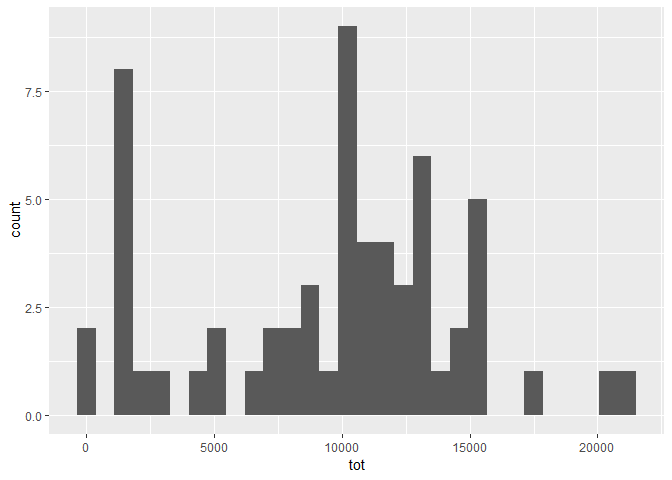
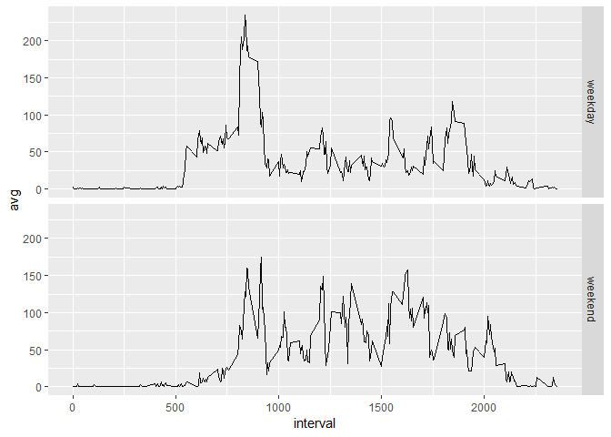

## Loading and preprocessing the data
### Load the data and format the date column as a date.

```r
library(lubridate)
```

```
## 
## Attaching package: 'lubridate'
```

```
## The following object is masked from 'package:base':
## 
##     date
```

```r
library(dplyr)
```

```
## 
## Attaching package: 'dplyr'
```

```
## The following objects are masked from 'package:lubridate':
## 
##     intersect, setdiff, union
```

```
## The following objects are masked from 'package:stats':
## 
##     filter, lag
```

```
## The following objects are masked from 'package:base':
## 
##     intersect, setdiff, setequal, union
```

```r
library(ggplot2)
df <- read.csv("activity.csv", stringsAsFactors=FALSE)
df$date <- as_date(df$date)
```

## What is mean total number of steps taken per day?

```r
spd <- summarise(group_by(df, date), tot = sum(steps, na.rm=TRUE))
avg_spd <- mean(spd$tot)
med_spd <- median(spd$tot)
```
### ANSWER: The mean steps taken per day is 9354.2295082, and the median steps taken per day is 10395.

```r
ggplot(data=spd, aes(tot)) + geom_histogram()
```

```
## `stat_bin()` using `bins = 30`. Pick better value with `binwidth`.
```

<!-- -->

## What is the average daily activity pattern?

```r
intrvl <- summarise(group_by(df, interval), avg = mean(steps, na.rm=TRUE))
max_intrvl = intrvl[which.max(intrvl$avg),]$interval
```
### ANSWER: The 5-minute interval with the maximum number of steps, on average across all the days in the dataset, is 835.

```r
ggplot() + geom_line(data=intrvl, aes(x=interval, y=avg), stat="identity")
```

<!-- -->

## Imputing missing values

```r
cnt_na <- sum(is.na(df$steps))
df_cln <- df
df_cln$steps[is.na(df_cln$steps)] <- tapply(df_cln$steps, df_cln$interval, median, na.rm=TRUE)
spd_cln <- summarise(group_by(df_cln, date), tot = sum(steps, na.rm=TRUE))
avg_spd_cln <- mean(spd_cln$tot)
med_spd_cln <- median(spd_cln$tot)
```
### ANSWER: The total number of missing values is 2304.
### The clean data (using median of each 5 minute interval) has a mean steps taken per day of 9503.8688525, and a median steps taken per day of 10395.  As a result, the mean increases by about 150 steps and the median is the same.

```r
ggplot(data=spd_cln, aes(tot)) + geom_histogram()
```

```
## `stat_bin()` using `bins = 30`. Pick better value with `binwidth`.
```

<!-- -->

## Are there differences in activity patterns between weekdays and weekends?
### ANSWER: The individual is more active throughout the day on the weekends.

```r
df$day_type <- as.factor(ifelse(wday(df$date, week_start=1)<6, "weekday", "weekend"))
intrvl_dow <- summarise(group_by(df, interval, day_type), avg = mean(steps, na.rm=TRUE))
ggplot() + geom_line(data=intrvl_dow, aes(x=interval, y=avg), stat="identity") + facet_grid(day_type~.)
```

<!-- -->
